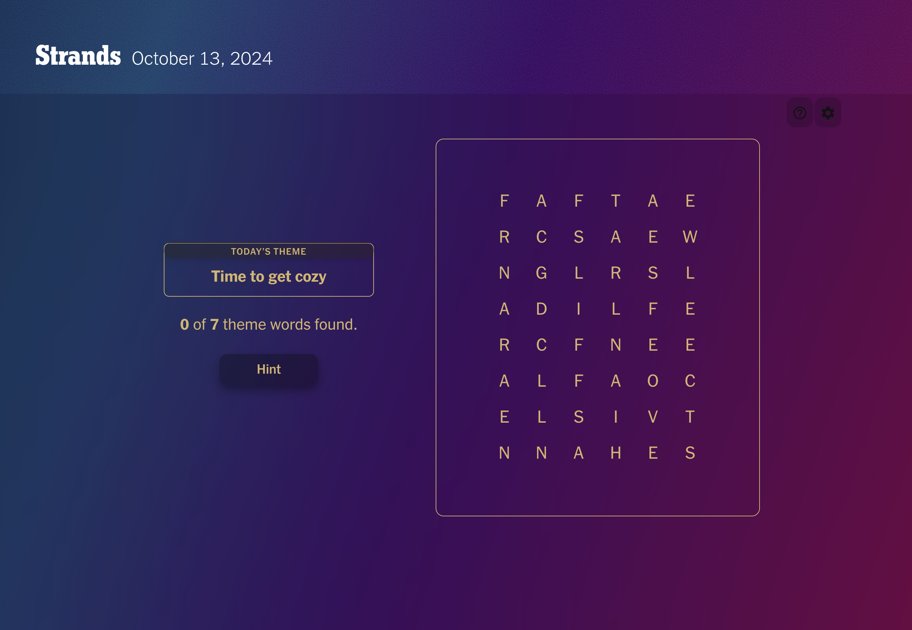
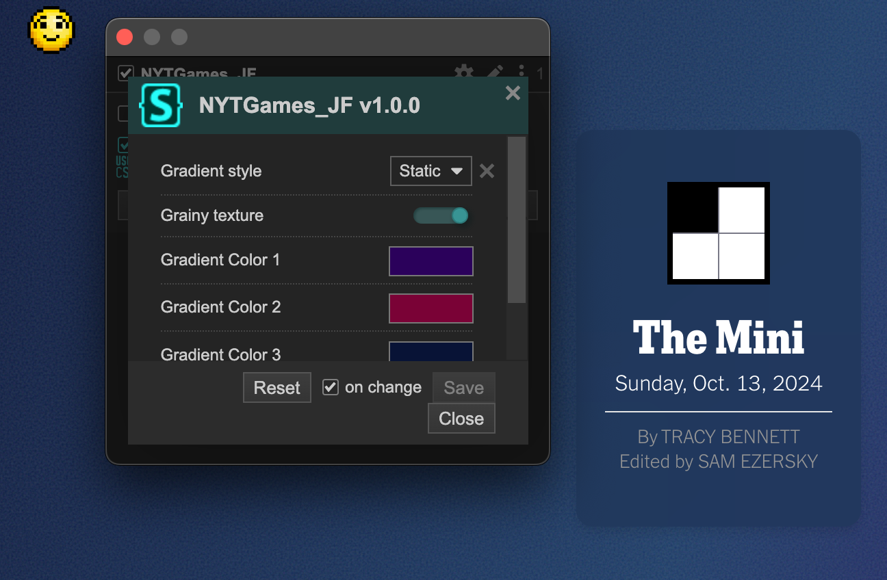
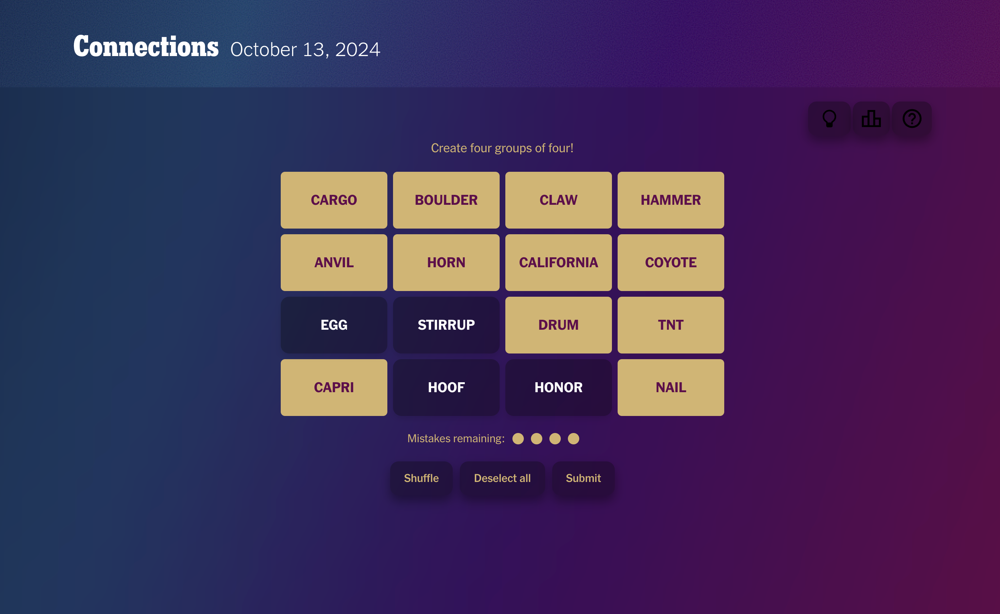

# Sensha & FallenStar's night-time NYT Games  

This is the third in a - hopefully short - series of ""design"" projects. I made it because the website of the New York Times Games was horrendous and kept flashing Fallen's eyes. 

## Visuals 

The UI is much prettier and will not destroy your eyes in a way even Dark Reader couldn't prevent. 

As per usual, it also has a pretty acrylic automatically sliding sidebar, which is neat. 

If you do not like the gradient or if you are like me and you like changing colors all the time, you can change the colors directly through Stylus' UI. It's pretty neat and instantaneous. I also added a toggle for the grainy texture and the background now comes with three options: 
- Animated gradient (default)
- Static gradient
- No gradient

I also added two little scripts that auto-fill your starter word in WORLDE. If you are like me and like to use the same word everytime you can use the configurable script and just enter your starter word in the first few lines. If you are like Fallen and *need* a new word everytime, you can use the randomized script that will pull a random 5 letters word from a list of 14000 words and pre-fill it for you. 

### Installation 

Install the css using Stylus

-   [Firefox](https://addons.mozilla.org/en-US/firefox/addon/styl-us/)
-   [Chrome](https://chromewebstore.google.com/detail/stylus/clngdbkpkpeebahjckkjfobafhncgmne)

Once you have Stylus, you can install the theme directly clicking here: 

Install le JS scripts using whatever people use to manage userscripts. I used [ViolentMonkey](https://violentmonkey.github.io/) because that's what Fallen used. Can be done directly once you have the userscript manager installed by clicking here: 

- Sidebar Styling: 

- Configurable auto-fill for WORDLE Starter word :

- Randomized auto-fill for WORDLE Starter word :

I recommend installing at least sidebar and choose whichever version of the auto-fill you'd like for your WORDLE. 

### Credits 

- [Fallen](https://github.com/FallenStar08) - We did 48 WORDLE together before I had the good sense of doing this. 

